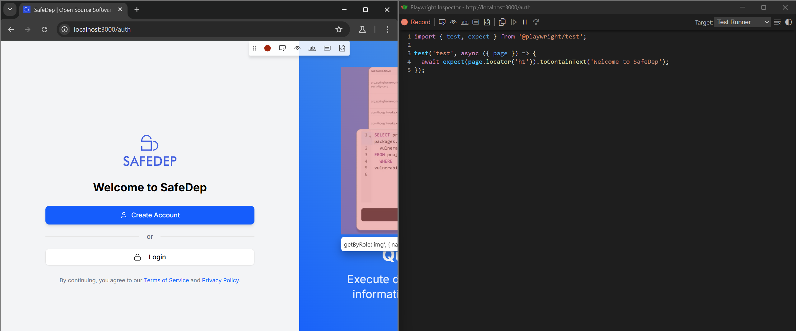

# E2E Testing Quick Guide

We perform E2E testing using `playwright`.

## Running Tests

Run test using:

```bash
pnpm test:e2e
```

Run test in a browser using:

```bash
pnpm test:e2e --ui
```

## Creating Tests

Use Playwright codegen to automate creating tests. Read more about [Playwright Codegen Mode](https://playwright.dev/docs/codegen).

To start codegen mode:

1. Start the application server:

   ```bash
   pnpm dev
   ```

   This should start the Nextjs application at `localhost:3000`.

2. Start playwright codegen mode:

   ```bash
   pnpm playwright codegen http://localhost:3000/
   ```

3. Select elements and the UI will automatically generate testing code. Once
   done, just copy it.

   

4. Then create a file in `e2e/` directory with a suitable name (eg.
   `my-test.spec.ts`) as paste the copied code.

## How authentication works

Authentication is handled by a setup script
([`auth.setup.ts`](../e2e/auth.setup.ts)) that logs into the application using
environment-provided credentials (`.env.e2e`). The authenticated browser state
is serialized to a `user.json` file, which subsequent tests leverage to
maintain authentication without repeating the login process.

## Environment variables

All environment variables required to run E2E tests are defined in
[`e2e/config/env.ts`](../e2e/config/env.ts). In other words, `env.ts` is the
source of truth for env vars.
